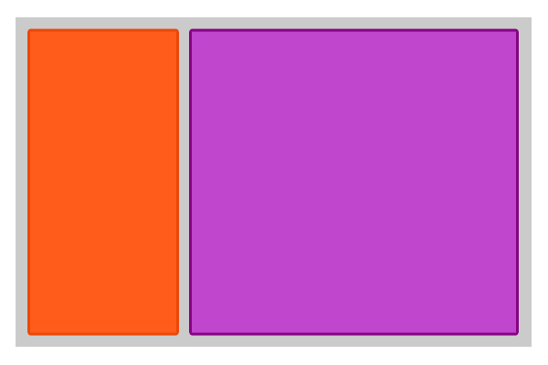
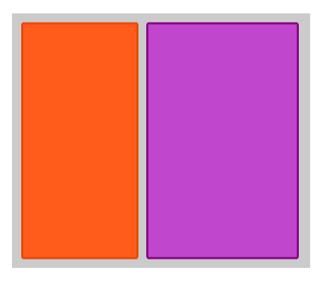

# Фиксированная и резиновая верстки

Одна из основных проблем дизайна сайтов и Web-приложений в том, что сайт может быть загружен, на огромном количестве экранов с абсолютно разными разрешениями(огромная плазма и мобильный), соотношением сторон(вертикальный просмотр, горизонтальный просмотр) и условиями работы(ночь или улица в солнечный день).

До появления адаптивной верстки по сути было два подхода - фиксированная верстка и резиновая, которые в той или иной мере комбинировали. Оба подхода используются и по сей день, хотя бы как этапы адаптивной верстки.

Базовое отличие этих двух версток в том, что в фиксированной верстке мы задаем ширину в пикселях

```html
<div style="width:200px">
</div>
```

В резиновой верстке ширина задается в процентах

```html
<div style="width:100%">
</div>
```

Давайте посмотрим, что мы можем сделать с этим на практике.

В фиксированной верстке мы делаем макет с центральным блоком, выравненным по середине. Ширина центральной области обычно 960px, так чтобы помещаться на мониторы с любым разрешением, включая iPhone и iPad.

Примеры сайтов: 

http://alawar.ru<BR>
http://film.ru

Резиновая верстка создается следующим образом. Когда Вы задаете ширину блока в процентах, проценты считаются от ширины родительского элемента. Если Вы поместите такой блок внутрь body, то его ширина будет  пропорциональна ширине экрана.

С вложенными блоками у нас есть два варианта - сделать их фиксированной ширины, а отступы между ними сделать резиновыми, либо сделать их пропорциональными ширине блока

Внутри одного сайта, мы можем комбинировать элементы резиновой и фиксированных версток.

Например, в приведеном ниже макете голубые полоски являются резиновыми и занимают всю ширину экрана, а блок по центру соответствует фиксированной верстке.


Если Вы верстаете сайт по PSD-шаблону или другому графическому файлу, у Вас может возникнуть вопрос - какую верстку хотел применить дизайнер? Если дизайнер имел хотя бы минимальный опыт в веб-дизайне - ответ прост. Если у элемента нет полей по бокам - подразумевается его резиновость. Если поля есть, значит скорее всего фиксированный.

**Пропорциональное изменение ширины и высоты**

Допустим наш шаблон выглядит вот так


Если блоки резиновые при сжатии, мы получим следующую картину


Происходит это потому, что ширина блоков при сжатии уменьшается, а вот высота остается неизменной. Даже если мы поставим высоту в процентах - это оставит ситуацию без изменений, так так высота сайта при его сжатии не изменяется.

Хотелось бы, чтобы блоки уменьшались пропорционально, то есть квадраты оставались бы квадратами


Добиться этого можно следующим образом. Поставить высоту блока 0px, а padding-top равным ширине. Например

```html
<div style="height:0px;width:25%;padding-top:25%">
</div>
```

Если Вы попробовали реализовать данную схему, нам остается понять, почему это работает:) Дело в том, что padding, указанный в процентах высчитывает эти проценты не от ширины самого блока, а от ширины блока-родителя, точно также как и ширина. Поэтому 25% в padding-top'e будут равны 25% ширины.


**calc**

Давайте рассмотрим следующий шаблон



При уменьшении ширины серого блока, оранжевый должен сохранять свою ширину, а фиолетовый должен быть резиновым.



Серый блок мы можем задать в процентах, но вот с фиолетовым блоком все сложнее. Его ширина - это ширина серого блока минус фиксированная ширина оранжевого блока.

Для этого нам может пригодиться функция calc

Допустим ширина родительского блока 100%, ширина левой колонки 200px. Тогда ширину правой колонки мы можем записать как

```css
width:calc(100% - 200px)
```

НАЛИЧИЕ ПРОБЕЛОВ КРИТИЧНО!


**Практика:**

1) Резиновый шаблон с фиксированной левой колонкой

2) Резиновый шаблон с двумя фиксированными колонками