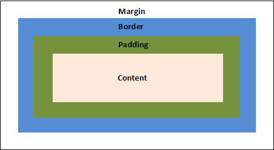
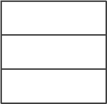
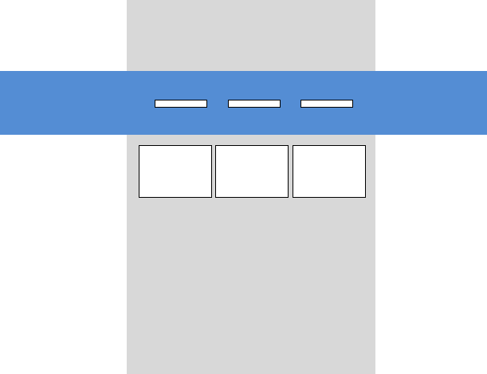

# Отступы

По умолчанию все отступы добавляются к ширине контента. Каждый вид отступа имеет свои особенности, хотя визуально они похожи. Чтобы запомнить порядок отступов, можно подумать о такой аналогии: представьте печатный текст на бумаге - это наш контент. Теперь добавим к тексту поля по краям, ведь когда текст прижат к краю, это не очень красиво. Такие поля будут padding'ом. Поставим этот лист бумаги с текстом в рамку - это будет border. И теперь мы можем решать на каком расстоянии будет рамка от остальных объектов - это будет margin.



**Padding** – «внутренний» отступ(выводится внутри границы). На padding распространяется цвет фона контента. Ширина padding’a добавляется к ширине и высоте контента.

Заметим, что цвет паддинга как и в случае с листом бумаги передается ему от контента.

У нас есть 4ре направления, по которым мы должны задать padding. И у нас есть множество способов как это сделать.

Вариант, когда мы задаем все 4ре направления по отдельности. Чтобы запомнить порядок задания достаточно знать, что направления идут по часовой стрелке, от "12ти" часов.

```css
padding: 25px 50px 75px 100px;
```
верхний padding равен 25px<BR>
padding справа равен 50px<BR>
bottom снизу равен 75px<BR>
padding слева равен 100px<BR>

Вариант с тремя направлениями легче всего запомнить представив ромб. Первое значение задает верх, второе отступы по бокам и последнее идет вниз.

```css
padding: 25px 50px 75px;
```
верхний padding равен 25px<BR>
padding'и справа и слева равны 50px<BR>
нижний padding равен 75px<BR>

вариант с двумя значениями используется довольно часто - мы задаем первым значением отступы сверху и снизу и вторым отступы справа и слева.

```css
padding: 25px 50px;
```
верхний и нижний padding'и равны 25px<BR>
правые и левые paddings равны 50px<BR>

Ну и когда нам нужно сделать одинаковый со всех сторон отступ, делаем просто одно значение.

```css
padding: 25px;
```
Отступы со всех сторон равны 25px

Можно задавать padding отдельно по направлениям

```css
padding-top:10px;
padding-right:20px;
padding-bottom:30px;
padding-left:40px;
```

padding-bottom - устанавливает padding снизу

padding-left - устанавливает padding слева

padding-right - устанавливает padding справа

padding-top - устанавливает padding сверху


**Margin**

margin – внешний отступ(делает отступ снаружи границы).

У margin'a нет цвета, margin всегда прозрачен.

Правила использования margin’a, аналогичны padding’у – просто слово padding меняется на margin

**margin:0;** для body

margin:0px; для body убирает белые отступы по краям документа

```css
body {
    margin:0;
}
```

**margin:0 auto** 

margin:0 auto; – выравнивает блок по центру, по ширине. Пример ниже выравнивает красный div с классом block по центру экрана.

```css
div.block {
    width:300px;
    height:200px;
    background-color:red;
    margin:0 auto;
}
```


**Границы**

**border** - это граница блока. В отличии от margin и padding мы можем задать цвет для border'a. Также как в случае с margin и padding ширина border'a добавляется к ширине блока.

Мы можем написать все свойства границы сразу, задав ширину, стиль (solid - это непрерывная граница), цвет.

```css
border: 3px solid black;
```

А можем задавать их по отдельности:

```css
border-width:3px; // ширина
border-style:solid; // стиль
border-color:red; // цвет
```

Мы можем задавать границу отдельно по направлениям

```css
border-top:1px dotted red; //сверху граница красными точками
border-bottom-style: dashed;
```

Можно задавать border-width по всем направлениям

```css
border-width: 2px 10px 4px 20px;
```

Если нам нужна граница со всех сторон, кроме заданной то мы можем поступить следующим образом.

```css
.semi_block {
    border:10px solid orange;
    border-bottom:0px solid orange;
}
```

То есть мы окружаем блок границей со всех сторон, а потом убираем ее снизу, выставляя границу толщиной 0

**outline** – граница, которая возникает вокруг объекта, при его выборе курсором. Синтаксис outline аналогичен border'у. Например:

```css
outline:1px dotted grey;
```

Для чего же кроме border нам может понадобиться еще и outline!? Во-первых, мы можем отключить выделение у объекта, которое в отличии от границы не скругляется. Во-вторых outline - очень удобная вещь при отладки верстки, так как outline не сдвигает верстку, а накладывается на нее.

**Полезное чтиво**

1. *Расстановка полей и отступов в CSS*
https://habrahabr.ru/company/netcracker/blog/281008/

2. _Использование теории близости для расстановки отступов_
https://spark.ru/startup/logo/blog/28397/teoriya-blizosti-glavnoe-pravilo-dizajna-kotoroe-rasstavlyaet-vse-po-mestam?from=vc

3. _Модификация отступов у формы_
https://hsto.org/files/b94/832/419/b94832419cf54ae7be1193ff2fedd934.gif

4. Проблемы со схлопывающимися margin'ами
https://cmichel.io/css-margin-top-not-working


**Практика:**

1.	Сделать один блок под другим. Между ними сделать расстояние высотой в один блок. Оба блока должны быть выровнены по центру по горизонтали<BR><BR><BR><BR>
2.	Есть три блока в линию, с небольшими отступами между ними. Выровнять всю эту конструкцию по центру по горизонтали.<BR><BR><BR><BR>
3.	Сделать вот такую конструкцию и выровнять ее по центру<BR><BR><BR>
4.	Необходимо сделать верстку следующего макета. Синие блоки резиновые(растягиваются на весь экран), серый блок фиксированный по ширине и находится по середине(при любом размере окна браузера)<BR><BR><BR><BR>

5. Три ячейки одна на другой с границами. Обратите внимание, что граница везде одинарная
  
6. Сделать меню в шапке сайта. Все слова меню должны быть по центру "шапки" по вертикали и иметь одинаковые отступы справа и слева.

7. Макет 
Центральная область(серые блоки) должна быть фиксированной, а синяя полоска резиновой.

    
8. Есть пункты меню (слова разной ширины). Нужно добиться, чтобы каждое слово оборачивалось в блок, ширина блока автоматически подстраивалась под ширину слова, и каждый такой блок имел снизу подчеркивание.


