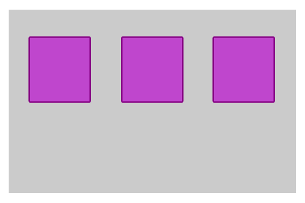
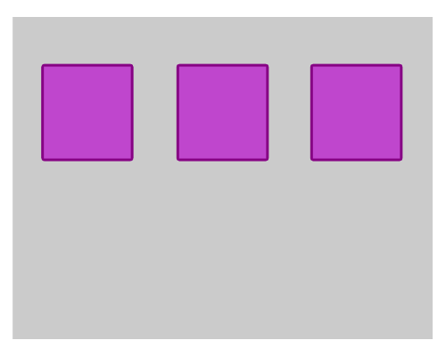
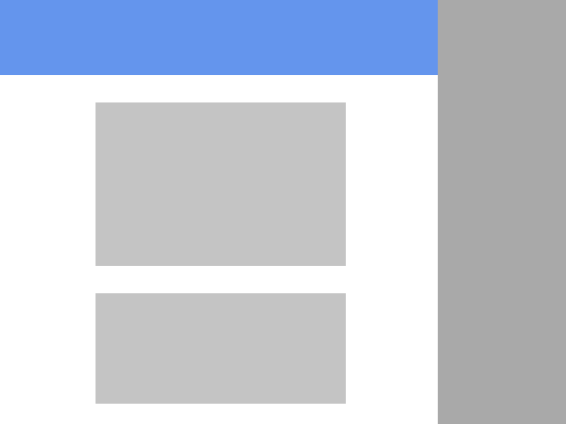

# Фиксированная и резиновая верстки

Одна из основных проблем верстки сайтов в том, что сайт может быть загружен, на огромном количестве экранов с разными размерами по ширине. При этом нужно добиться, чтобы сайт везде выглядел симпатично.

Для решения этой задачи возникло два подхода: первый, при увеличении размеров окна, мы растягиваем контент(резиновая верстка), второй делаем контейнер с фиксированными размерами и спокойно работает внутри него(фиксированная верстка). Оба подхода используются и по сей день, хотя бы как этапы адаптивной верстки.

В фиксированной верстке мы задаем ширину контейнера в пикселях и, как правило, выравниваем его посередине.

```css
.container {
    width:980px;
    margin:0 auto;
}
```

В резиновой верстке ширина задается в процентах

```css
.container_fluid {
    width:100%
}
```

Давайте посмотрим, что мы можем сделать с этим на практике.

В фиксированной верстке центральный блок имеет ширину обычно 980px, так чтобы помещаться на мониторы с любым разрешением, включая iPhone и iPad.

Примеры сайтов: 

http://alawar.ru<BR>
http://film.ru

Резиновая верстка создается следующим образом. Когда Вы задаете ширину блока в процентах, проценты считаются от ширины родительского блока. Если Вы поместите такой блок внутрь body, то его ширина будет  пропорциональна ширине экрана.

С вложенными блоками у нас есть два варианта - сделать их фиксированной ширины, а отступы между ними сделать резиновыми, либо сделать их пропорциональными ширине блока

Внутри одного сайта, мы можем комбинировать элементы резиновой и фиксированных версток.

Например, в приведеном ниже макете голубые полоски являются резиновыми и занимают всю ширину экрана, а блок по центру соответствует фиксированной верстке.


**min-width и min-height**

Если мы задали ширину блока в процентах, то при сжатии окна блок также будет сжиматься. Если мы хотим остановить этот процесс обжатия блока на каком-то моменте, чтобы, например, чтобы не страдал контент блока, можно задать минимальную возможную ширину блока

например вот так

```css
.container_fluid {
    width:100%;
    min-width:980px;
}
```


**calc**

Давайте рассмотрим следующий шаблон


При уменьшении ширины серого блока, синий блок должен сохранять свою ширину, а белый должен быть резиновым.


Серый блок мы можем задать в процентах, но вот с белым блоком все сложнее. Его ширина - это ширина серого блока минус фиксированная ширина синего блока.

Для этого нам может пригодиться функция calc

Допустим ширина родительского блока 100%, ширина левой колонки 200px. Тогда ширину правой колонки мы можем записать как

```css
width:calc(100% - 200px)
```

НАЛИЧИЕ ПРОБЕЛОВ КРИТИЧНО!

**Пропорциональное изменение ширины и высоты**

Допустим наш шаблон выглядит вот так



Если блоки резиновые при сжатии, мы получим следующую картину


Происходит это потому, что ширина блоков при сжатии уменьшается, а вот высота остается неизменной. Даже если мы поставим высоту в процентах - это оставит ситуацию без изменений, так так высота сайта при его сжатии не изменяется.

Хотелось бы, чтобы блоки уменьшались пропорционально, то есть квадраты оставались бы квадратами



Добиться этого можно следующим образом. Поставить высоту блока 0px, а padding-top равным ширине. Например

```css
.chained_sizes_block {
    height:0px;
    width:25%;
    padding-top:25%;
}
```

```html 
    <div class="chained_sizes_block">
    </div>
```

Если Вы попробовали реализовать данную схему, нам остается понять, почему это работает:) Дело в том, что padding, указанный в процентах высчитывает эти проценты не от ширины самого блока, а от ширины блока-родителя, точно также как и ширина. Поэтому 25% в padding-top'e будут равны 25% ширины.


**Фиксированные и резиновые верстки в дизайне**

Если Вы верстаете сайт по PSD-шаблону или другому графическому файлу, у Вас может возникнуть вопрос - какую верстку хотел применить дизайнер? Если дизайнер имеет хотя бы минимальный опыт в веб-дизайне - ответ прост. Если у элемента нет полей по бокам - подразумевается его резиновость. Если поля есть, значит скорее всего верстка фиксированная.

Пример бесплатных PSD-шаблонов можно найти на сайте http://freebiesbug.com/psd-freebies/website-template/


**Практика:**

1. Резиновый шаблон с фиксированной левой колонкой

2. Резиновый шаблон с двумя фиксированными колонками по бокам


3. "Резиновая" галерея картинок
4. Сделать, чтобы картинки были резиновые, а отступы между ними были фиксированные(шаблон должен занимать весь экран)

5. Сделать два квадрата. Меньший квадрат должен быть посередине по вертикали и горизонтали меньшего

    
    
6. Используя calc выровнять блок по центру экрана

7. Сверстать шаблон сайта. Сайдбар справа фиксированный по ширине, синий хедер резиновый, блоки контента фиксированные по ширине и выровнены посередине хедера. 
8. Шаблоны c http://signature.ai/