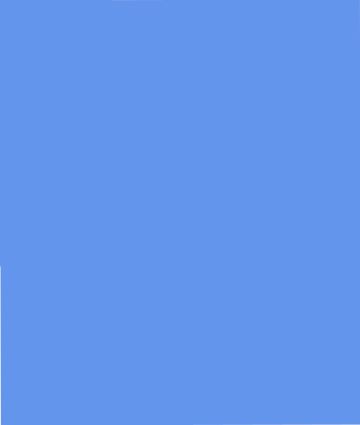
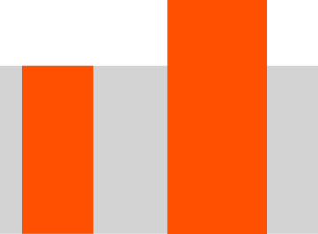
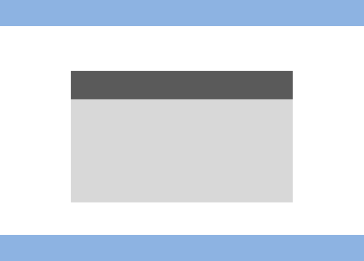

# Свойства фона

**background-color** – задает цвет фона, например

```css
background-color:red;
```
сделает цвет фона красным

**background-image** - задает фоновую картинку
```css
background-image:url('image_url.jpg');
```

Фоновая картинка всегда закрывает собой фоновый цвет

**background-size** - задает размер фоновой картинки

можно задавать background-size как в пикселях

```css
background-size:   200px 100px; 
```

так и в процентах

```css
background-size:  100% 100%; 
```

Значение **cover** - растягивает фоновую картинку до тех пор, пока она не закроет собой блок<BR>


Значение **contain** - сужает фоновую картинку, пока она полностью не поместится в блок



**background-repeat**

repeat - значение по умолчанию, заполняет блок фоновой картинкой как плиткой.

```css
background-repeat: repeat;
```
repeat-x - повторяет блоки по горизонтали
					
repeat-y; - повторяет блоки по вертикали
					
no-repeat; - вообще без повторения
					
**background-position** - задает смещение от левого верхнего края

в пикселях
```css
background-position:  100px 30px;
```
или процентах

```css
background-position:  30% 20%;
```
или с помощью ключевых слов

```css
background-position: left center;
```

Для того, чтобы посмотреть как работают эти свойства перейдите по ссылке:
https://www.w3schools.com/cssref/playit.asp?filename=playcss_background-position

**background-attachment** -определяет как именно будет вести себя фон блока при скроллинге

По умолчанию стоит значение background-attachment:scroll - то есть фон перемещется вместе с блоком, и мы воспринимаем блок и фон как что-то цельное.

background-attachment:fixed - оставляет фон на месте. То есть блок воспринимается как пространство, через которое мы видим фон.

**background-clip** - определяет куда именно будет распространяться фоновый цвет - по границу, по padding или только по контенту.
 
По умолчанию имеет значение border-box, то есть фон контента будет и под границами тоже

padding-box - фон только по padding'у

content-box - фон только по контенту

Играясь с цветом границы(border) и padding'a(задается через фоновый цвет content'a) можно получить необычные результаты.

**background-origin** - аналогичное свойство для фоновой картинки

**background**

Все перечисленнные свойства можно объединить в одном

```css
background: color image position/size repeat origin clip attachment initial|inherit;
```

Необязательно указывать все свойства. Достаточно ограничиться только несколькими или даже одним! Например мы можем сократить описание свойства background-color до

```css
background:red
```

**Множественные фоны**

Мы можем указать несколько фонов в конструкции background. Первый фон в списке будет самым верхним.

```css
.block {
    background:url('duke.gif') center/100px 50px,
               url('stairs.jpg') center/cover;
}

```
Либо отдельно по свойствам фона

```css
.block {
    background-image:url('duke.gif'),url('stairs.jpg');
    background-size:100px 50px,cover;
    background-position:center,center;
}
```


**background-clip:text**

Свойство имеет три основных значения, и определяет как далеко будет распространяться фоновая картинка.

```css
background-clip: border-box;
background-clip: padding-box;
background-clip: content-box;
```

Только content, padding или же даже на уровень границы.               

background-clip:text - единственное экспериментальное значение среди всех значений background-clip, которое еще не вошло в стандарт. Тем не менее, позволяет делать интересные эффекты, например текст, через который мы видим фон.

```css
.block {
	width:500px;
	height: 300px;
	text-align: center;
	line-height: 300px;
	font-family: Arial;
	font-size:40px;
	font-weight:bold;
	background-image:url(totem.jpg);
	background-clip: text;
	color:transparent;
}
```

**Полезное чтиво:**

1. Паттерны для бесшовных фонов http://subtlepatterns.com/
2. Множественные фоны http://habrahabr.ru/company/microsoft/blog/137705/
3. Создание интересных эффектов, с помощью https://tympanus.net/codrops/css_reference/background-clip/
4. Как делать необычные эффекты с текстом
https://css-tricks.com/how-to-do-knockout-text/


**Практика:**

1. Делаем блок, у него выводим фоновую картинку
2. Выводим фоновую картинку, так чтобы она закрывала собой экран. Сверху делаем полупрозрачное меню. Центр фоновой картинки должен совпадать с центром меню даже при сжатии окна.
3. Делаем блок на весь экран. Добавляем на него фоновую картинку с background-attachment:fixed. Ставим после него блок с высотой в несколько экранов, чтобы появился скроллинг.
4. Делаем несколько блоков с background-attachment:fixed, чтобы достичь эффекта переключения слайдов
5. Накладываем несколько фоновых картинок одна на другую. Для выполнения этого задания Вам понадобятся файлы с прозрачным фоном.
6. Сделать адаптивную галлерею картинок. Используем блоки, background-size:cover. Блоки должны уменьшаться пропорционально по высоте и ширине.

7. Делаем шаблон, приведенный на картинке. Хедер и футер должны быть полупрозрачными. Под всеми блоками есть фоновая картинка


