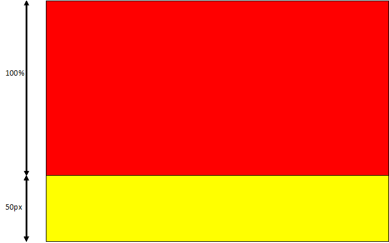

# Приклеивание футера

Есть несколько вариантов, как можно приклеить футер. Один из них более старый и соответственно кросс-платформенный, а второй более новый, но использует calc, что отсекает ранние версии Internet Explorer'a. Хотя сейчас это не так и страшно.

1. Делаем блок на весь экран, то есть выставляем для него следующие свойства

    ```css
        .content {
            width:100%;
            height:100%;
            background:red;
        }
    ```
    Нужно убрать отступы у body через margin:0;
    Если все сделано правильно, мы должны увидеть цветной блок во все окно, без скроллинга
    
    Если блок не виден из-за высоты 0 или подстраивается под высоту контента, то смотрите примечание 1

2. Теперь добавим блок футера. Пропишем следующие свойства

    ```css
        .footer {
            width:100%;
            height:50px;
            background:yellow;
        }
    ```
    
    Получаем
    
    
  	
    Сейчас у нас есть скролинг, так как к 100% высоты основного блока добавляется 50px футера
    
3. Добавим отрицательный margin-top, чтобы футер поднялся вверх на свою высоту.

```css
    .footer {
        width:100%;
        height:50px;
        background:yellow;
        margin-top:-50px;
    }
```
Если все сделано правильно наш футер будет «приклеен» к низу при любом разрешении экрана

**Есть несколько моментов из-за чего это все может не работать**

1. Иногда браузер игнорирует height:100% у блока. Это происходит из-за того, что 100% отсчитывается от высоты родительского блока. Родительским блоком является body, для которого родительским является html. Так вот у html по умолчанию height стоит в значении auto – то есть по высоте контента.

    Для исправления этой проблемы поставим у html и body высоту 100%
    
    ```css
    html,body {
        height:100%;
    }
    ```
    В этой ситуации html возьмет свою высоту от высоты окна, а body возьмет 100% от высоты html
 
2. Если контента больше чем на один экран, это может привести к тому, что футер будет «разрезать» контент на две части. Понятно, что в этой ситуации, нам нужен футер не внизу экрана, а снизу страницы. Было бы неплохо иметь один и тот же шаблон на разное количество контента
Чтобы решить эту проблему меняем height:100% на min-height:100% у основного блока.

3. Чтобы футер не закрывал контент в основном блоке, добавим в него прозрачный блок высотой с футер

**Вариант прилипающего футера через calc**

В браузерах, в которых нормально работает функция calc можно реализовать прилипающий футер гораздо проще.

Делаем футер фиксированной высоты

```css
.footer {
    height:50px;
    width:100%;
    background-color:cornflowerblue;
}
```

А основному блоку задаем высоту через calc

```css
.content {
    height:calc(100% - 50px)
}
```
 
**Практика:**

1. Делаем макет, указанный на картинке. Хедер и футер должны быть полупрозрачными. Футер должен быть приклеен к низу. У сайта есть фоновая картинка, которая занимает целый экран


2. Делаем макет, указанный на картинке. Сайдбары должны быть полупрозрачными. Высота хедера и футера фиксированная, ширина сайдбаров также фиксированная


3. В предыдущем шаблоне делаем хедер, футер и сайдбары полупрозрачными, а центральную часть прозрачной. Добавляем фоновую картинку на весь экран.


