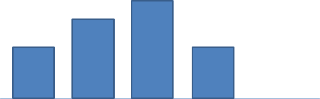
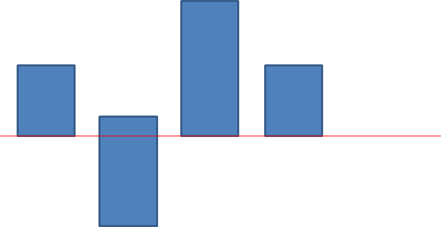
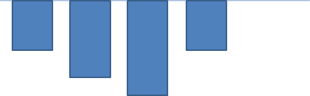
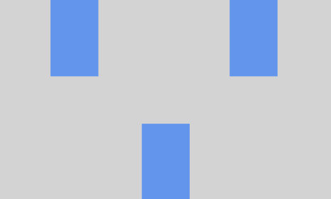

# Свойства текста

Свойства текста интересны тем, что многие из них применяются не только к тексту, но и к inline-block элементам.

**text-decoration** - определяет будет или нет подчеркивание у текста<BR>
	*underline*  - нижнее подчеркивание<BR>
	*overline* – линия над текстом<BR>
	*line-through* – перечеркнутый текст<BR>
	*none* – оформление отсутствует (попробуйте применить это значение к гиперссылке, чтобы получить ссылку без подчеркивания)

**text-align** – выравнивание текста и инлайн элементов по горизонтали.<BR>
	*center* – по середине<BR>
	*left* – влево<BR>
	*right* – вправо<BR>
	
Обратите внимание text-align воздействует на содержимое блока, к которому он применяется.

Например

```html
<div class="block">
Это текст, который должен быть выровнен по центру
</div>
```
Зададим css

```css
.block {
	width:100%;
	height:300px;
	text-align:center;
}
```

**vertical-align** – выравнивание блока внутри строчки по вертикали<BR>
	*top* – по верху<BR>
	*bottom* – по низу<BR>
	*middle* – по середине<BR>
	
В отличии от text-align, vertical-align применяется не к внутреннему содержимому блока, а непосредственно к самому блоку.	
	
**line-height** - высота строки 

Хак: если выставить высоту строки равной высоте блока, то строчка текста выровняется посередине, по высоте.

Хак: в предыдущих разделах, выполняя задание, Вы могли столкнуться с тем, что между двумя рядами display:inline-block элементов могли появляться горизонтальные строчки. Это вызвано тем, что есть некоторая высота строки и inline-block элемент добавляется не в самый низ строки. Решить эту проблему можно, выставив line-height:0; для родительского блока.

_Пример использования line-height в процентах_
https://www.w3schools.com/cssref/tryit.asp?filename=trycss_line-height

**word-spacing** - отступ между словами. Свойство можно применить к display:inline-block блокам, задав его для родительского блока

```css
.parent {
    word-spacing:40px;
}
```

**word-wrap** - разбивает длинные слова и делает принудительный перенос

```css
word-wrap: break-word;
```

http://shpargalkablog.ru/2013/02/word-wrap.html

https://css-tricks.com/snippets/css/prevent-long-urls-from-breaking-out-of-container/

**white-space** - определяет будет или не будет перенос слова при наталкивании на пробел.

normal - обычное поведение. При необходимости перенести слово, это делает по пробелу

nowrap - пробелы воспринимаются как буква и являются неделимыми символами

```css
white-space:nowrap;
```

**hyphens** - дефисы

hyphens: none | manual | auto

https://css-tricks.com/almanac/properties/h/hyphenate/

**letter-spacing** - отступ между буквами

**text-indent** - отступ у абзаца

**text-shadow** - тень от текста, будет подробнее рассмотрена в CSS3 свойствах.

**text-transform**

none - значение по умолчанию
capitalize - каждое слово начинается с большой буквы
lowercase - приводим все буквы к нижнему регистру
uppercase - приводим все буквы к верхнему регистру

https://www.w3schools.com/cssref/pr_text_text-transform.asp

**text-overflow**


clip - просто обрезает текст

ellipsis - ставит в конце текста три точки

кросс-браузерное решение

```css
  width: 250px;
  white-space: nowrap;
  overflow: hidden;
  text-overflow: ellipsis;
```


**Практика:**

1. Выровнять три блока по центру по горизонтали


Задача: разместить блоки разной высоты в линию


2. Теперь попробуем добавить текст в один div’ов. Как видим один из блоков уезжает вниз. Его позиция кажется бесмысленной, но на самом деле всего блоки выровнены по так называемой базовой линии (baseline)


3. Для того, чтобы исправить ситуацию, нужно применить свойство vertical-align:bottom  для выравнивания по низу блоков, либо vertical-align:top для выравнивания по верху блоков

Задача: разместить блоки разной высоты в линию по верхнему краю


4. Делаем блоки со словами внутри. Выравниваем в нем текст по вертикали и горизонтали 
5. Делаем блоки разной ширины с одинаковыми отступами между ними
6. Делаем блок и ставим длинное слово внутрь его. Обеспечиваем переносы.
7. Создаем шаблон, указанный ниже. Размеры блоков фиксированные

8. Есть блок с фоновой картинкой. На картинке есть небольшое затемнение. Поверх затемнения есть текст(одно слово), выровненный по вертикали и горизонтали.
9. Берем сетку из airbnb. Выстраиваем блоки со словами внутри них
10. Сделать верстку в стилистике pinterest

**Интересное чтиво:**<BR>
Пошаговое руководство как оформлять текст на сайте<BR>
http://jgthms.com/web-design-in-4-minutes/
