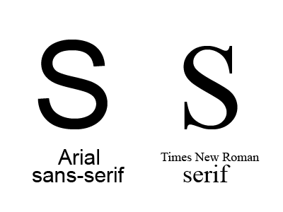

# Настройки шрифта

Как только у нас на странице появляется текст, у нас тут же возникает желание поменять его шрифт. У нас есть набор стандартных свойств, а также возможность подгрузить внешний шрифт. Сначала разберем стандартные свойства.

**color** – задает цвет шрифта. В отличии от остальных свойств идет без слова font

**font-size:10px;**  - размер шрифта

Помимо пикселей мы можем задавать в огромном количестве единиц, но полезными будут только em,rem,vh,vw,vmin,vmax

1em - это размер шрифта в родительском блоке. То есть, если Вы поставили font-size:2em; для блока, то шрифт в нем будет в два раза больше, чем в родителе. Такой подход отчасти удобен, потому что мы можем выставить размер шрифта для родителя или даже для корневого элемента и пересчитать весь документ.

Если же у нас и размеры блоков задаются через em(что логично для интерфейсов с текстом), то мы получаем очень гибкий к перестройке интерфейс.

Проблемы могут начаться, если мы будем генерировать вложенные блоки с одинаковым классом и отличным от еденицы font-size. Например 0.5em. Спустя два блока по вложенности у нас будет шрифт 0.25 от исходного

1rem - призван решить эту проблему. Ведь 1rem - это размер шрифта в корневом элементе. Для html-документа - это тег html.

Единицы vh,vw,vmin,vmax будут разобраны в разделе [Viewport](19_viewport.md)

**font-weight** - "жирность" шрифта

по умолчанию имеет значение normal, но можно сделать шрифт жирным через значение bold

```css
font-weight:bold;  
```

Если мы посмотрим значения по ссылке ниже, то увидим, что есть еще множество значений bolder,lighter, числовые значения. По факту для того, чтобы они работали они должны быть реализованы в шрифте, но обычно это не так. Поэтому по сути остаются значения normal и bold

https://www.w3schools.com/cssref/pr_font_weight.asp

           
**font-style**

```css
font-style: normal; 
```
   
Значение italic задает курсив. Значение oblique(сильно наклоненный), как правило, в шрифтах не реализован и отображается просто как наклонный.

https://www.w3schools.com/cssref/pr_font_font-style.asp

**font-family** - гарнитура шрифта  
    
```css    
font-family:'Times New Roman', Times, Serif
```

font-family - выбирает гарнитуру шрифта. Наш сайт, может загрузиться на различных операционных системах и платформах (Windows, Linux, Mac), и там может не оказаться нашего шрифта. Поэтому создаем список шрифтов. Если мы оказались на Mac'e - там вряд ли есть Times New Roman (шрифты с пробелами указываем в кавычках), но там есть похожий шрифт Times.

В конце списка шрифтов мы можем задать семейство шрифтов. Если мы хотим использовать шрифт с засечками, то лучше применить семейство Serif. Шрифтам без засечек соответствует семейство Sans-serif



**font** - обобщенное свойство. То есть мы можем задавать свойства шрифта через него

font: font-style font-variant font-weight font-size/line-height font-family

Например

```css
font: italic bold 12px/30px Georgia, serif;
```

Но чаще ограничиваются размерами и гарнитурой

```css
font:12px Airborne;
```


**Web safe fonts** – подборка шрифтов, которые доступны на большинстве компьютеров

http://www.cssfontstack.com/
http://www.w3schools.com/cssref/css_websafe_fonts.asp


**Убираем отступы между display:inline-block элементами**

Ставим font-size:0px для родительского элемента


**Подключение внешних шрифтов**

Используем конструкцию @font-face


```css
@font-face {
    font-family:myFirstFont;   
    src:url(sansation_light.woff); 
}
```

font-family -название, под которым мы будем использовать данный шрифт

В src записываем адрес файла шрифта

В дальнейшем мы можем подключать шрифт к любому блоку через font-family: myFirstFont например

```css
.our_text {
    font-family:myFirstFont;
}
```

```html
<div class="out_text">
Это div, внутри которого будет наш шрифт
</div>
```


**Google Fonts**

Можно использовать библиотеку шрифтов от Google https://www.google.com/fonts

Выбирайте шрифты, которые хотите подключить. Google предложит Вам два варианта для их подлючения через link или через @import. Вариант с link выглядит, например, вот так.

```html
<link href='https://fonts.googleapis.com/css?family=Oswald' rel='stylesheet' type='text/css'>
```

Добавляете в head и смотрите, что получилось.


**Font Squirell**

Сервис Font-Squirell  http://www.fontsquirrel.com/  - генерирует все необходимые форматы шрифтов. Можно убрать лишние символы и таким образом обжать размер шрифта.

Допустим у Вас есть ttf-файл. Вам нужен раздел Generator. Выбираем upload fonts -> переключаемся в режим expert. Выставляем все Font Formats. В строчке Subsetting выбираем Custom Subsetting. Оставляем в шрифте кириллицу, выбирая Cyrillic. Скорее всего Вам понадобятся значки валют, поэтому ставим флажок в Currency

Нажимаем Download Your Kit

У Вас скачается коллекция различных форматов шрифтов, а также css со способом их установки. Также будет демо html-файл. Порой, если у Вас не работает кириллица в каком-то браузере(как правило IE:), только эта демка способна вернуть веру в то, что это возможно.

**Font Awesome**

Популярным вариантом использования шрифтов, является использования иконочных шрифтов, то есть шрифтов, у которых символы являются иконками. Один из таких шрифтов - http://fontawesome.io/

Заходим на сайт, нажимаем download

Далее через link rel нам нужно подключить font-awesome.min.css

```html
<link rel="stylesheet" href="css/font-awesome.min.css">
```

Далее, чтобы добавить иконку нам понадобится следующая конструкция

```html
<i class="fa fa-car" aria-hidden="true"></i>
```

fa - это стандартный класс font-awasome, fa-car - класс иконки автомобиля.

Всё в целом это должно выглядеть вот так

```html
<head>
<link rel="stylesheet" href="css/font-awesome.min.css">
</head>
<body>
<i class="fa fa-car" aria-hidden="true"></i>
</body>
```

Полученный пример должен вывести иконку автомобиля

_Увеличение fa-2x_

Если мы хотим увеличить наши значки, то мы можем воспользоваться классами fa-2x, fa-3x, fa-4x, fa-5x

```html
<head>
<link rel="stylesheet" href="css/font-awesome.min.css">
</head>
<body>
<i class="fa fa-car fa-4x" aria-hidden="true"></i>
<i class="fa fa-rocket fa-2x"></i>
</body>
```

_Вращение fa-spin_

Иногда нам нужна иконка задержки при загрузке. Как правило такие иконки вращаются. Для вращения используется класс fa-spin. Попробуйте пример с иконкой fa-spinner

```html
<i class="fa fa-spinner fa-4x fa-spin" aria-hidden="true"></i>
```

<i class="fa fa-spinner fa-4x fa-spin" aria-hidden="true"></i>


Примеры от FontAwesome можно посмотреть здесь
http://fontawesome.io/examples/


**Структура проекта**

Теперь у нас появилось довольно много в нашем проекте разных файлов и пришло время их структурировать. Разобъем файлы по папкам.

```
сss - для css файлов
fonts - для шрифтов
img - для картинок
js - для JavaScript библиотек
```

При таком разбиении нужно учесть изменения в путях. Например, чтобы добраться до картинки из css, нужно сначала в путях выйти из папки css с помощью двоеточия, а потом зайти в папку img

```css
background-image:url(../img/odessa.jpg)
```

**Полезное чтиво:**

1. Размеры шрифта em,rem,vh
https://learn.javascript.ru/css-units

2. _Инфографика рассказывающая о типах шрифтов_
http://designinstruct.com/roundups/10-infographics-that-will-teach-you-about-typography/

3. Игры для дизайнеров. Игра Kern Type
http://www.ucreative.com/articles/9-games-for-graphic-designers/

4. Примеры совместимых пар шрифтов с Google Fonts
http://fonts.greatsimple.io

5. _Гельветика - документальный фильм о легендарном шрифте_
https://vimeo.com/15659366

6. Очень подробно о шрифтах от Алексея Каптерева
https://habrahabr.ru/company/mailru/blog/344132/


**Практика:**
1. Делаем высоту блока, в три раза больше, чем высота шрифта
2. Скачать шрифт Lobster с https://fontstorage.com и подключить его к тексту.
3. Подключить один из Google Fonts
4. Сгенерировать набор шрифтов из ttf-файла в сервисе Font Squirrel

5. Воспользоваться каким-то из символьных шрифтов, например Font Awesome
6. Сделать три блока. Разместить их в ряд. Добавить текст с подключенным внешним шрифтом внутрь каждого блока
7. Делаем интерфейс чата для двух собеседников через em'ы