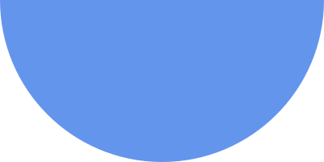

# Скругления и тени

В 2008 году, чтобы сделать скругленный прямоугольник, приходилось рисовать в графическом редакторе четыре накладки на каждый угол прямоугольника и потом позиционированием накладывать их на каждый из углов. Не проходило и пол часа как Ваша кнопочка со скругленными краями была готова. Теперь нужно было отключить ложные клики по краям, и да: всё это можно было сделать только на однотонном фоне, иначе накладки были видны. А потом появилось свойство border-radius.

**border-radius** – задает радиус скругления

Представим что у нас есть прямоугольник. Например

```css
.block {
     width:100px;
     height:100px;
     background:purple;
}
```
Добавим к нему скругление в 10px по краям

```css
border-radius:10px;
```

Получим фиолетовый квадрат со скруглениями по краям

```css
.block {
     width:100px;
     height:100px;
     background:purple;
     border-radius:10px;
}
```

Можно задавать скругление отдельно по углам

```css
border-radius:5px 10px 15px 20px;
```

Если хотим получить круг ставим border-radius:50% у квадрата

Можно задавать скругление ввиде эллипса

```css
border-radius: 10px/20px;
```

10px - горизонтальный радиус
20px - вертикальный радиус

Если поиграться с настройками, то можно получить даже полукруг.

```css
.semi_circle {
     width:200px;
     height:100px;
     border-radius:50% 50% 50% 50% / 0% 0% 100% 100%;
}
```



**Полезное чтиво:**

1. CSS-tricks о border-radius
     https://css-tricks.com/almanac/properties/b/border-radius/
2. Очень подробно разобрано, что мы можем сделать, используя border-radius
https://m.habr.com/company/ruvds/blog/426731/
оригинальная статья
https://9elements.com/io/css-border-radius/

3. О свойстве box-decoration-break
     https://developer.mozilla.org/en-US/docs/Web/CSS/box-decoration-break
4. Генератор border-radius'ов
     https://9elements.github.io/fancy-border-radius/#0.49.0.51--.

**box-shadow** - задает тень у объекта

Логика этого свойства следующая: представим, что у под каждым объектом находится тень. Она по размерам ровно соотвествует размерам блока, поэтому её не видно. Свойство box-shadow занимается тем, что может сместить тень относительно объекта(первые два свойства), размыть её(при этом тень увеличится, но края будут нерезкими), а также сделать тень больше(или меньше, если значения отрицательные), чем сам объект.

```css
box-shadow: 1px 2px 3px 4px #ccc;
```

1px – смещение слева<BR>
2px – смещение сверху<BR>
3px – радиус размытия<BR>
4px – увеличение размеров тени (padding для тени)

Цвет тени лучше делать полупрозрачным через rgba

_Множественные тени_

Можем сделать несколько теней и сымитировать несколько границ у объекта.

```css
box-shadow: 0px 0px 0px 10px #c00,
            0px 0px 0px 20px #00c;
```
_Внутренняя тень_

Добавление параметра inset создает внутреннюю тень. Позволяет сгенерировать эффект вдавленности.  

```css
box-shadow: inset 0 0 10px #000000;
```

_Подробнее:_<BR>
https://css-tricks.com/almanac/properties/b/box-shadow/     

http://www.w3schools.com/css/css3_shadows.asp


**text-shadow**

Мы можем задать тень для текста

```css
text-shadow: 0 0 3px #FF0000;
```


**Полезное чтиво:**

1. Эффекты для текста:
http://enjoycss.com/gallery/text_effects/ec

2. Пример с вдавленным текстом
https://wp-lessons.com/vnutrennyaya-ten-teksta-v-css

3. Пример с внутренней тенью для текста
https://codepen.io/adambundy/pen/HtmaK

4. Дизайн-тренды, которые уже не в моде
http://designshack.net/articles/graphics/5-former-design-trends-that-arent-cool-anymore-so-stop-using-them/

5. О применении свойства background-clip:text
https://webplatform.news/issues/2018-11-02


**Практика:**

1. Выводим круглый аватар с двумя каемочками
2. Сделать ghost-button
3. Сделать "простроченный" элемент
4. Верстаем страницу «профиль пользователя» в стиле iOS (круглый аватар, ссылка в прозрачном блоке)
5. Делаем фотографию с внутренней тенью https://habrahabr.ru/post/154211/
6. Делаем retro-эффект для текста http://enjoycss.com/gallery/text_effects/ec

7. Делаем текст с эффектом вдавленности text-shadow (вариант с background-clip:text)
8. Верстаем шаблон  

9. Верстаем шаблон формы залогинивания сервиса Zeplin. input'ы заменяем на div'ы


