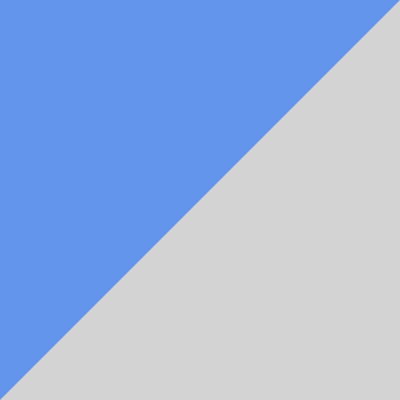

# Градиенты

Начнем с базовых градиентов. Нам понадобится два цвета и направление градиента.

```css
div {
  width:500px;
  height: 500px;
  background-color: yellow;
  background-image:
    linear-gradient(
     110deg, 
      red, blue
    );
}
```
110deg - это 110 градусов. Отсчет градусов начинается от верха

Рассмотрим более сложный пример

```css
div {
  height: 100px;
  background-color: red;
  background-image:
    linear-gradient(
      to right,
      red,
      yellow 25%,
      yellow 35%,
      green 50%
    );
}
```

У многих возникает вопрос, почему проценты в примере в сумме не дают 100%? Это вызвано тем, что проценты тут указывают не  ширину полоски, а отсчет расстояния от начала. То есть представьте, что у Вас маршрут в 100км. Когда Вы проехали 25км - цвет должен стать желтым. Проехали еще 10 или 35 км от начала - цвет по прежнему желтый, но далее он плавно становится зеленым, и к 50км мы видим зеленый. Зеленый цвет сохранится до конца маршрута.

**Редактор градиентов**
http://www.colorzilla.com/gradient-editor/<BR>
http://uigradients.com/#


**Радиальные градиенты**

```css
background-image:radial-gradient(circle farthest-corner at 45px 45px, white 0%, red 50%);
```

**Повторяющиеся градиенты**

Примеры сайтов с градиентами<BR>
http://line25.com/articles/web-design-trend-showcase-super-gradients

**Полезное чтиво:**

1. CSS-tricks про градиенты
https://css-tricks.com/css3-gradients/

2. CSS patterns
  http://lea.verou.me/css3patterns/
  https://24ways.org/2011/css3-patterns-explained/
  
3. Действительно ли Вы понимаете CSS-градиенты
  https://medium.com/@patrickbrosset/do-you-really-understand-css-linear-gradients-631d9a895caf
  
4. Эффект загнутого уголка у листа бумаги https://webformyself.com/sozdajte-prostoj-effekt-zagnutogo-ugolka-na-css/


**Практика:**

1. Создать базовый градиент
2. Есть фотография. Нужно наложить на нее полупрозрачный градиент.
3. Задать градиент так, чтобы получить следующую картинку    

4. Создать градиент полосами. Флаг Колумбии
5. Сделать «карамельный» фон для progress bar’a
6. Делаем круг радиальным градиентом
7. Делаем мишень радиальным градиентом
8. Делаем круг с бликом
9. Сделать круг заполненный полосочками


10. Сделать фотографию с тремя секторами градиентов http://www.coline-game.com/
11. Создаем вокруг блока градиентную границу.

Бонус http://www.niekdekker.com/

