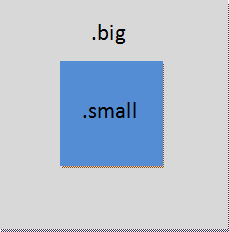
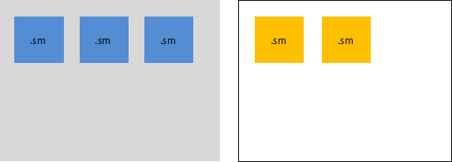

# Псевдоклассы


Поскольку объекты страницы могут принимать разные состояния, нам нужны конструкции, которые бы позволяли с этими состояниями работать

**:hover** – псевдокласс, который срабатывает в тот момент, когда над объектом находится курсор.
Например если написать в css-файле

```css
.block{
    background:blue;
    width:100px;
    height:100px;
}

.block:hover {
	background:red;
}
```

То данный код будет окрашивать div’ы с классом block в красный цвет при наведении на них курсора.

**:visited** – определяет цвет гиперссылки после того как она была «посещена», то по ней произошел переход на сайт.
Задание: сделать, чтобы гиперссылки по умолчанию не подчеркивались, а при наведении на них курсора подчеркивание возникало. Посещенные ссылки должны окрашиваться в красный цвет.

**:active** – срабатывает при клике на объект. Правда active работает только до тех пор, пока мы держим клавишу зажатой.

**:focus** – срабатывает, когда у элемента с фокусом, например, когда в input'e есть мигающий курсор ввода

```html
<input type="text">
```

```css
input:focus {
     border:10px solid purple;
}
```

**Контекстные селекторы**

Допустим у нас есть блок-корзина и товары. Мы хотим, чтобы товары при перемещении в корзину получали специальное оформление, например обводились границей.





```css
.cart {
	width:400px;
	height:200px;
	background-color:grey;
}
.product {
	width:100px;
	height:100px;
	background-color:cornflowerblue;
}
```

Но если товар попал в корзину, то должна появится корзина
```css
.cart  .product {  
	border:20px solid black;
}
```


**Контекстные селекторы и псевдоклассы**

Можно группировать контекстные селекторы с псевдоклассами. 

```css

.big:hover .small {
    background:red;
}

```

Данное оформление означает, что к элементу .small , который находится внутри .big , на который навели курсор.

**Неочевидные моменты**

1. При наведении курсора на вложеный элемент, срабатывает hover и на родителе.
2. Селектор в контексте имеет больший приоритет, чем селектор без контекста

Рассмотри следующий css-файл

```css
.parent .block {
	background-color:orange;
}

.block {
    width:100px;
    height:100px;
    background-color:violet;
}
```

соответствующий ему html

```html
<div class="parent">
   <div class="block">
   </div>
</div>
```

Сначала нам кажется, что блок будет фиолетовым, так как селектор с ним стоит ниже, но засчет контекста, мы получим оранжевый.

**Примеры**

1. Различные hover-эффекты при наведении на кнопку
http://codepen.io/fox_hover/pen/bqZxLa

2. Кнопки с градиентами, которые меняют их при наведении
http://codepen.io/pirrera/pen/bqVe
3. Библиотека различных hover-эффектов  
http://ianlunn.github.io/Hover/


**Практика:**

1.	Нужно сделать, чтобы гиперссылка по умолчанию была без подчеркивания, но при наведении начинала подчеркиваться
2.	Изменение цвета div'a при наведении
3. Картинка закрыта градиентом. При наведении градиент пропадает.
4.	Задаем разные цвета блоков-детей у разных блоков-родителей с помощью контекстных селекторов

5.	Строим спрайт. При наведении меняем картинку на ее черно-белую копию
6.	При наведении на блок, вложенные блоки показываются

7. Есть картинка на фоне блока. При наведении картинка приближается, блок не увеличивается.
8.      Есть меню с вложенными подпунктами. При наведении на пункт меню, появляются его подпункты.
9.	Есть картинка при клике на нее, она увеличивается и сохраняет свои размеры до тех пор пока на ней курсор мыши.


