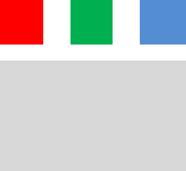

# Расширенные CSS селекторы

Рассмотрим еще несколько видов селекторов, которые вместе с псевдоклассами позволят нам создавать очень необычные варианты оформления.

**Х+Y**

Применяется к селектору Y, если он идет в коде сразу после X.

Для примера возьмём два блока с классами first и second

```css
.first {
    width:100px;
    height:100px;
    background:grey;
    display:inline-block;
}

.second {
    width:100px;
    height:100px;
    background:cornflowerblue;    
    display:inline-block;
}```


Добавим в CSS участок с селектором +

```css
.first + .second {
    border:10px solid black; 
}
```

тогда в следующем примере у блока с классом .second появится граница

```html
<div class="first">
</div>
<div class="second">
</div>
```


А вот если добавить хотя бы один блок посередине, то границы уже не будет

```html
<div class="first">
</div>
<div class="block_in_the_middle">
</div>
<div class="second">
</div>
```


```html
<div class="sword">
</div>

<br><br><br>

<div class="orks">
</div>
<div class="sword">
Orks are here
</div>

```

```css
.sword {
background:grey;
width:200px;
height:100px;
}

.orks {
width:500px;
height:500px;
background:darkolivegreen;
}

.orks+.sword {
background:cornflowerblue;	
}
```

**Х ~ Y**

```css
.first ~ .second {
    border:10px solid black; 
}
```

Этот CSS-селектор очень похож на X + Y, однако, является менее строгим. Теперь если блок second находится в коде после блока first, то к нему применится граница.

В этом случае second будет с границей.


```html
<div class="first">
</div>
<div class="second">
</div>
```

Для селектора **~** блок **block\_in\_the\_middle** - не помеха

```html
<div class="first">
</div>
<div class="block_in_the_middle">
</div>
<div class="second">
</div>
```


_Селектор будет работать только для элементов с общим родителем!_


**Х&gt;Y**

```css
.parent>.child {
    border:10px dashed black;
}
```

Разница между стандартными Х Y и X &gt; Y состоит в том, что рассматриваемый CSS-селектор будет выбирать только непосредственные дочерние элементы. Рассмотрим следующий код.

```html
<div class="parent">
    <div class="child">
        <div class="child">
        </div>
    </div>
</div>
```

**.parent &gt; .child** применится к "внешнему" child'у, но не применится к внутреннему

**.parent .child** применится к двоим блокам класса child

**Практика:**

1. При наведении на первый блок, следующий за ним должен менять цвет.
2. Есть четыре блока с одинаковым классом. При наведении на любой из этих блоков должен меняться цвет у последующего блока.
3. Есть блок. В нем два вложенных блока. Один из них скрыт. При наведении на внешний блок, видимый вложенный блок скрывается, невидимый – появляется.
4. При наведении на иконку меню, она преобразуется в полноценное меню. Пока курсор находится на меню - меню удерживается
5. Сделать, чтобы блок при нажатии увеличивался, менял цвет и держал свой размер, пока мы с него не переместимся

6. Три цветных блока и один серый под ними. При наведении на любой из цветных блоков, серый окрашивается в тот же цвет.  
   

7. Есть галерея фотографий. При наведении на фотографию, показываем ее в большом блоке
8. Реализуем систему классов для "вложенных" комментариев \(пример [http://habrahabr.ru](http://habrahabr.ru)\)


