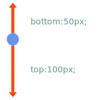
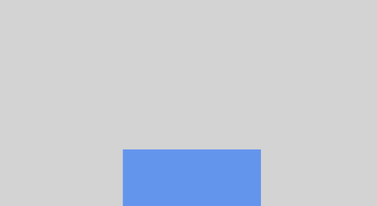
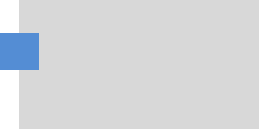
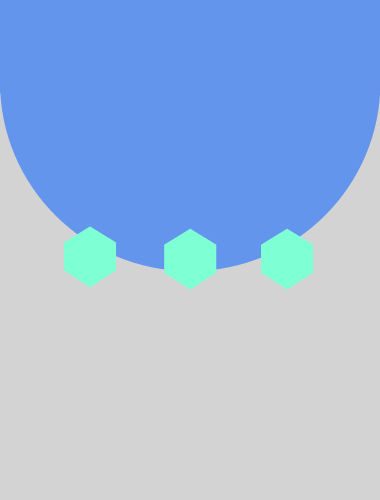

# Позиционирование

Ранее мы познакомились с блочными и строчными элементами. Если мы используем только их, то весь сайт можно представить в виде списка элементов, которые «укладываются» в соответствующие размеры экрана по правилам блочных и строчных элементов. Такой подход называют «потоком элементов»
Тем не менее это не единственный подход к расстановке элементов на сайте.

Возьмем свойство position. По умолчанию, оно имеет значение static.
Это значит, что если мы выставим настройки, указанные ниже

```css
div {
	position:static;
}
```
то местоположение блока не поменяется

**position:relative;** - также вначале не изменит местоположение объекта, но даст возможность это сделать через свойства top, left,right,bottom. Задавая эти значения можно будет сметить объект относительно его позиции

Например

```css
div {
    position:relative;
    left:200px;
    top:100px;
}
```
блок сместится относительно своей позиции на 200px вправо(от левого края) и на 100px вниз

Если мы попытаемся одновременно поставить блоку top и bottom, то каждая точка блока сместится на разницу в этих направлениях.




**position:fixed;** - полностью игнорирует местоположение объекта в потоке и выставляет объект относительно левого верхнего угла экрана. Смещение относительно левого верхнего угла экрана также задается через top,left



```css
.block {
    height: 100px;
    width:200px;
    position:fixed;
    bottom:0;
    left:calc(50% - 100px);
}
```


**position:absolute;** - полностью похож на fixed в случае, если у блока нет «спозиционированного» родителя (т.е. родителя со свойством position отличного от static). Если же такой родитель есть – позиционирование идет от него.

**position:sticky;** - получаем "приклеенный" элемент при прокрутке. Но, к сожалению, такое позиционирование работает не во всех браузерах. Текущее состояние Вы можете посмотреть по ссылке
http://caniuse.com/#feat=css-sticky


**Полезное чтиво:**

1. Разбор position:sticky от CSS-tricks
https://css-tricks.com/position-sticky-2/

2. Как на самом деле работает position:sticky в CSS
https://medium.com/web-standards/sticky-bc7ff7088693

3. Пример интерфейса на position sticky
https://css-tricks.com/sticky-smooth-active-nav/

4. Различные эффекты с помощью position:sticky
https://css-tricks.com/creating-sliding-effects-using-sticky-positioning/

**Примеры работы всех position**
https://www.w3schools.com/cssref/playit.asp?filename=playcss_position


**Выравниваем блок по центру по вертикали и по горизонтали**

Вот такой вот хак позволяет выровнять один блок внутри другого.

```css
.block {
    position:absolute;
    margin:auto;
    top:0;
    left:0;
    right:0;
    bottom:0;
}
```


**Практика:**

1. Делаем сайт с вертикальным скроллингом. Делаем меню всегда оставалось "приклеенным" к верху даже при скроллинге.

2. Предыдущее задание, но прижимаем меню к низу окна.

3. Делаем боковое меню справа

4. Добавляем иконку меню, при наведении на которую, выезжает меню справа

5. Пробуем сделать верстку двух блоков так, чтобы в коде они шли в таком порядке
<BR><BR>А на экране размещались, так как указано на картинке снизу<BR><BR>

6. Ставим внутренний элемент на границу внешнего
 
 
7. Сделать, чтобы при наведении на элемент всплывала подсказка(tip)
  
8. Делаем cверху страницы меню, которое остается на месте даже при прокрутке. Меню скрыто, но при подведении курсора к верху появляется (плавненько).

9. Сайт состоит из картинок во весь экран. Добиться, чтобы при скроллинге, сбоку экрана появлялись какие-то "зверушки".

10. Верстаем шаблон

11. Сделать меню в стиле https://flyernest.com/en/