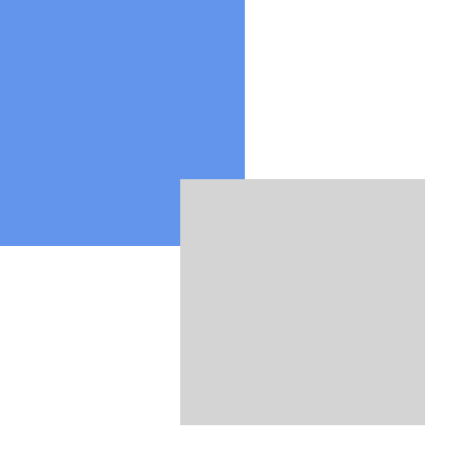
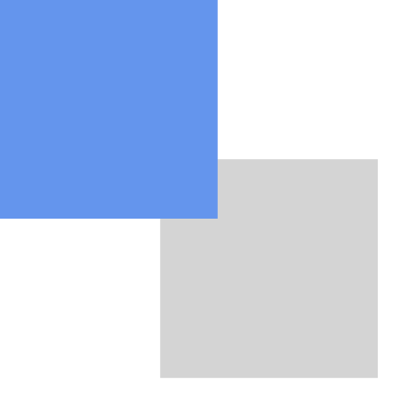

# Наложение объектов

**z-index**

При позиционировании два элемента могут начать пересекаться между собой. Чтобы определить какой элемент находится над другим нужно использовать свойство z-index

По умолчанию объекты имеют значение z-index:0 . Но мы можем убрать объект вниз
z-index:-1;
И поднять его над всеми z-index:10;

Очень важный момент, состоит в том, что z-index работает корректно только для элементов на одном уровне и с одинаковым набором свойств. Например элементы position:static и position:absolute имеют разную иерархию z-index
Отдельные иерархии у элементов с float и opacity

Хак: Как переместить вложенный блок под родительский? По умолчанию вложенный блок всегда над. Но это можно изменить

```css
.wrapper {
    position: relative;
}

.child {
    position: relative;
    z-index: -1;
}
```

Обратите внимание, что для родителя z-index в этой ситуации ставить не нужно!

**transition для z-index**

Для z-index работает плавное изменение с помощью transition. Это можно использовать для появления элементов с разной скоростью.


**opacity** - задает полупрозрачность блока. 0 - полностью прозрачный блок, 1 - не меняет прозрачность блока, то есть непрозрачный блок остается непрозрачным.

```css
div {
    opacity: 0.5;
}
```
Непрозрачность у вложенных элементов нельзя восстановить. То есть, если родитель полностью прозрачный, то и ребенок тоже всегда будет прозрачным.

То есть, если у нас два блока, один из которых вложен в другой, например так

```html
<div class="parent">
    <div class="child">
    </div>
</div>
```

и если мы зададим стили следующим образом

```css
.parent {
    opacity:0.5;
    width:200px;
    height:200px;
    background-color:darkolivegreen;
}

.child {
    opacity:1;
    width:200px;
    height:200px;
    background-color:orange;    
}
```

То у вложенного блока opacity всё-равно будет 0.5, то есть opacity вложенных блоков перемножаются.

Но если opacity больше единицы, то оно приводится к единице. То есть пример ниже будет аналогичен по внешнему виду примеру выше.

```css
.parent {
    opacity:0.5;
    width:200px;
    height:200px;
    background-color:darkolivegreen;
}

.child {
    opacity:2;
    width:200px;
    height:200px;
    background-color:orange;    
}
```

**visibility** - определяет будет ли показываться элемент
    visible - элемент виден
    hidden - элемент скрыт
    
Отличие visibility:hidden от display:none в том, что блок будет попрежнему занимать место, хотя мы его не будем видеть. При display:none блок просто исчезнет со страницы

**overflow** - определяет что именно будет происходить с контентом, выходящим за пределы блока.

По умолчанию у объектов стоит значение *visible*

*hidden* - скроет все выступающие элементы<BR>
*scroll* - добавит в блок скроллинг. Не самое популярное решение, так как скроллинг уменшит область под контент.

```css
div {
    width: 150px;
    height: 150px;
    overflow: scroll;
}
```

Хак: Если у Вас margin-top вложенного блока переходит на родительский, то overflow:hidden у родительского блока, блокирует выход margin'a за пределы блока, и всё начинает работать так, как Вы этого ожидаете.

Хак: Если родительский блок "не замечает" вложенные float элементы, например высота height:auto у родительского элемента преобразуется в 0, то overflow:hidden у родительского блока также решает эту проблему.

**Оверлеи**

Оверлей - это блок, который накладывается на весь экран. Все знакомы с оверлеями по раздражающему затемнению экрана, на котором выводится рекламный банер.

Рассмотрим один из способом создания оверлея

```css
.overlay {
    width:100%;
    height:100%;
    
    background-color:rgba(0,0,0,0.5);

    position:fixed;
    top:0px;
    left:0px;
   
    z-index:10;
}
```

Нам нужно, чтобы затемнение закрыло весь экран, соответственно выставляем ширину и высоту во весь экран. 
```css
    height:100%;
    width:100%;
```
Фоновый цвет делаем черным, но полупрозрачным.
```css
    background-color:rgba(0,0,0,0.5)
```

Поскольку мы хотим, чтобы затемнение было в любом месте экрана, даже если пользователь проскролил вниз, выставляем позиционирование фиксированным.
```css
    position:fixed;
    top:0px;
    left:0px;
```

Наш оверлей всегда должен быть поверх всего остального, поэтому выставляем z-index большим.
```css
    z-index:10
```

**Ромб с фоновой картинкой**

Поворачиваем квадрат с помощью трансформации на 45 градусов. 

Вложенную картинку поворачиваем на -45 градусов


**Фильтры**

https://habrahabr.ru/post/264037/

https://sarasoueidan.com/blog/compositing-and-blending-in-css/

https://medium.com/@bennettfeely/css-blend-modes-could-be-the-next-big-thing-in-web-design-6b51bf53743a#.qre4sonxu

**Полезное чтиво:**

1. Четыре техники создания оверлеев

    [http://tympanus.net/codrops/2013/11/07/css-overlay-techniques/](http://tympanus.net/codrops/2013/11/07/css-overlay-techniques/)
    

**Практика:**

1. Два блока пересекаются. Сделать два варианта наложения одного блока на другой


2. Создание блока с полупрозрачным фоном и непрозрачным текстом. Фон — фотография
3. Создать оверлей поверх сайта
4. При наведении на блок, на нем последовательно появляются блоки(transition для z-index)
5. Наводим на блок и из него плавно выезжает меню
6. При наведении на гиперссылку, вокруг нее возникает выделение. Выделение должно собираться из окружающегося пространства. Пример http://bradfrost.com/blog/post/7-habits-of-highly-effective-media-queries/
7. Верстка сайта с контентом в виде ромбиков (используем трансформации и position)
8. Сделать слайдер. Картинки меняются при наведении на навигационные кружочки
9. При наведении мышки на блок, фон, на котором он стоит размывается.
10. Есть фотография цветного товара, на однородном сером фоне. И есть цветные квадратики. При наведении на квадратик, товар окрашивается в цвет квадрата.
11. К низу сайта добавлен ярлык. При наведении на ярлык, всплывают пункты меню(подобно интерфейсу на мак)


