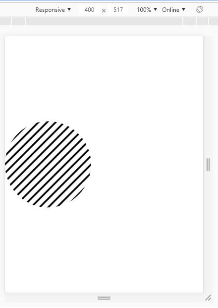

#Viewport

На мобильных устройствах сайт строится не под реальный физический экран, а под виртуальный, так называемый viewport

Например, на iPhone 4s ширина устройства 240px,  но сайт будет строиться под 980px. Это может привести к тому, что наши условия для адаптивности не сработают

Чтобы изменить ситуацию воспользуемся meta-тегом viewport и установим ширину виртуального экрана под количество пикселей на устройстве

```html
<meta name="viewport" content="width=device-width, initial-scale=1.0">
```

Если наш сайт и так хорошо смотрится на устройстве, мы можем выставить блокировку увеличения экрана

```html
<meta name="viewport" content="width=device-width, initial-scale=1.0, maximum-scale=1.0, user-scalable=no">
```

**min-aspect-ratio**

Определяет при каком соотношении сторон срабатывают Ваши медиа-запросы.

```css
@media screen and (min-aspect-ratio: 16/9) { ... }
```

**orientation**

Мобильное устройство может находится в двух режимах портретный(portrait) и альбомный(landscape)
Добавляем учет ориентации устройства в пространстве

```css
@media (orientation: landscape) {
     .block {
          background-color:red; 
     }
}
```

Для того, чтобы протестировать в браузере страницу под мобильные устройства, необходимо запустить панель разработчика (F12) и нажать на иконку мобильного телефона. Для того, чтобы появилась альбомная ориентация, нужно выбрать конкретное устройство.




Для устройств с высокой плотностью пикселей можем воспользоваться свойством resolution


Эмулятор Android
http://developer.android.com/sdk/index.html


**Единицы измерения vh, vw, vmin, vmax**

vh = 1% от высоты viewport'a

vw = 1% от ширины viewport'a

vmin - минимальное из vh, vw, то есть min(vh,vw)

vmax - максимальное из vh, vw

Это позволяет нам сделать блок высотой в один экран без оглядки на его блок-родитель

```css
.block {
     height:100vh;
}
```

**Полезное чтиво:**

1. Полезные идеи по media-запросам
http://bradfrost.com/blog/post/7-habits-of-highly-effective-media-queries/

2. Особенности media-запросов для принтеров
https://habrahabr.ru/company/ruvds/blog/317776/


**Практика:**

1. Берем адаптивный шаблон из прошлых заданий и нормализуем его работу под мобильными из прошлых уроков
2. Есть горизонтальная картинка. Меняем ее на вертикальную при изменении ориентации
3. Есть горизонтальное меню в хедере. При переходе на мобильный, меню превращается в иконку. При клике на иконку справа выезжает меню в вертикальном виде.
4. Делаем так, чтобы при горизонтальной ориентации телефона выводилось сообщение с просьбой выровнять экран вертикально.
5. При переходе на мобильный, меню сверху сайта перемещается вниз.
6. Делаем квадратный блок, который на горизонтальном экране занимает всю высоту, на вертикальном экране занимает всю ширину.


