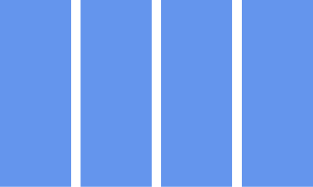
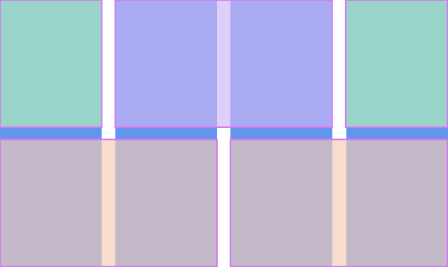
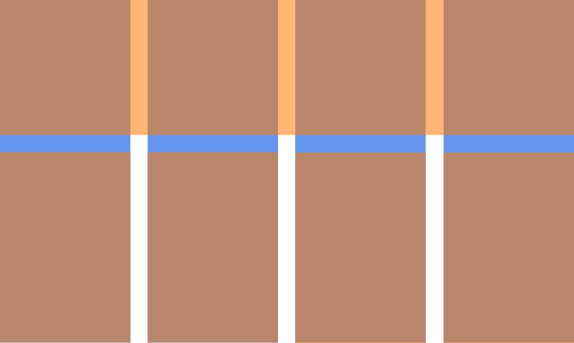
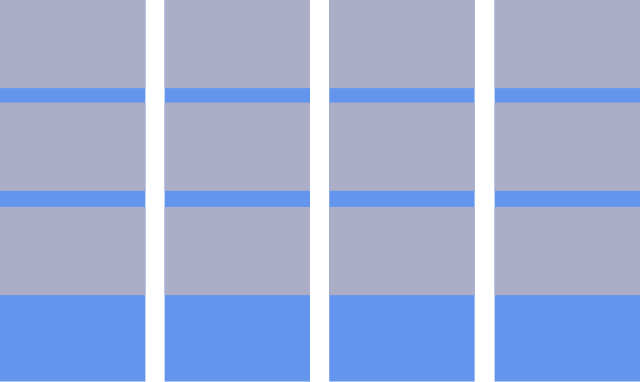

# Модульные сетки


**Концепция**

Как мы ранее обсуждали, наше подсознание пытаеся найти закономерности в окружающем мире. При верстке сайта мы можем ему помочь. Возьмем за основу структуры колонки 



Все наши блоки разместим так, чтобы отступы между блоками совпадали с отступами между колонками



Реализацию сетки можно посмотреть на примере сайта https://www.newyorker.com/


**Система классов**

Огранизуем систему классов для создания блоков нужной нам ширины

```css
.col_1 {
    width:25%;
}

.col_2 {
    width:50%;
}

.col_3 {
    width:75%;
}

.col_4 {
    width:100%
}
```

То есть блок с классом col_1 будет занимать по ширине одну колонку, а с классом col_3 мы займем три колонки. Единственный минус в текущем варианте у нас нет отступов между блоками. Давайте добавим их.

```css
body {
	margin:0;
}

.col_1 {
    width:calc(25% - 20px);
    display: inline-block;
    margin:0 10px;
}

.col_2 {
    width:calc(50% - 20px);;
    display: inline-block;
    margin:0 10px;

}

.col_3 {
    width:calc(75% - 20px);
    display: inline-block;
    margin:0 10px;
}

.col_4 {
    width:calc(100% - 20px);
    display: inline-block;   
    margin:0 10px;
}
```

И для того, чтобы не было отступов слева и справа обернем блоки в контейнер и добавим в к нему отрицательный padding

```css
.container {
	font-size:0;
	margin:0 -10px;
}
```

Теперь попробуем сделать вот такой шаблон(Нужные блоки отмечены оранжевым)





```html
    <div class="container">
        <div class="header col_4">
        </div>
        <div class="column col_1">
        </div>
        <div class="column col_1">
        </div>
        <div class="column col_1">
        </div>
        <div class="column col_1">
        </div>
    </div>
```

Зададим высоту и цвет для наших классов header и column

```css
.header {
    height:200px;
    background-color:cornflowerblue;
}

.column {
    height:calc(100% -200px);
    background-color:lightgrey;
}
```

**Вертикальный ритм**

Часто дизайнер и верстальщики упускают тот момент, что помимо колонок в дизайне необходима какая-то система и для горизонтальных линий. Такое повторение горизонтальных линий в шаблоне называется вертикальный ритм.



Еще более распространенной проблемой является то, что задуманный дизайнером вертикальный ритм при наполнении сайта контентом легко распадается(например заголовок будет на на одну строчку, а на две)


**Полезное чтиво:**

1. Концепция 8-ми пиксельной сетки
https://habrahabr.ru/company/everydaytools/blog/319700/

2. Подходы к созданию отзывчивой сетки
https://medium.com/re-write/designing-a-responsive-grid-in-2016-58e4db6db786#.r6j2w3dfg

3. Применение сеток к реальным сайтам
http://maketea.co.uk/2016/09/28/css-grid-layout-is-a-step-change.html

4. Необычные шаблоны
https://www.rachelandrew.co.uk/archives/2016/03/16/css-exclusions-and-grid-layout/

5. Эксперименты с отзывчивым дизайном 
http://labs.jensimmons.com/

**Практика:**

1. Применить сетку к одному из шаблонов http://signature.ai
