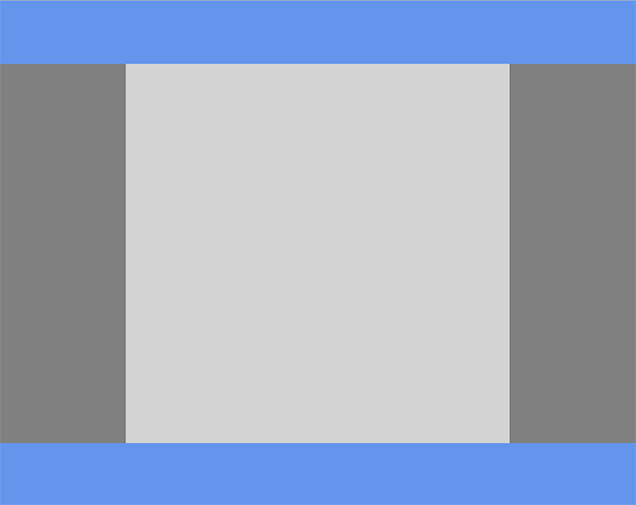

#Bootstrap

Bootstrap - является одним из популярных CSS-фреймворков(заготовок) для верстки сайта.

**Подключение**

Добавляем подключение bootstrap.min.css в head


```html
<link rel="stylesheet" href="https://stackpath.bootstrapcdn.com/bootstrap/4.2.1/css/bootstrap.min.css" integrity="sha384-GJzZqFGwb1QTTN6wy59ffF1BuGJpLSa9DkKMp0DgiMDm4iYMj70gZWKYbI706tWS" crossorigin="anonymous">
```

Подключаем скрипты внизу body

```html
<script src="https://code.jquery.com/jquery-3.3.1.slim.min.js" integrity="sha384-q8i/X+965DzO0rT7abK41JStQIAqVgRVzpbzo5smXKp4YfRvH+8abtTE1Pi6jizo" crossorigin="anonymous"></script>
<script src="https://cdnjs.cloudflare.com/ajax/libs/popper.js/1.14.6/umd/popper.min.js" integrity="sha384-wHAiFfRlMFy6i5SRaxvfOCifBUQy1xHdJ/yoi7FRNXMRBu5WHdZYu1hA6ZOblgut" crossorigin="anonymous"></script>
<script src="https://stackpath.bootstrapcdn.com/bootstrap/4.2.1/js/bootstrap.min.js" integrity="sha384-B0UglyR+jN6CkvvICOB2joaf5I4l3gm9GU6Hc1og6Ls7i6U/mkkaduKaBhlAXv9k" crossorigin="anonymous"></script>
```

Для запуска шаблона нам понадобится viewport соответствующий размерам устройства

```html
<meta name="viewport" content="width=device-width, initial-scale=1, shrink-to-fit=no">
```
Нужно также понимать, что box-sizing в Bootstrap установлен в значение content-box;

**Минимальный скрипт**

Добавим в body

```html
<div class="container-fluid">
  <h1>My First Bootstrap Page</h1>
  <p>This is some text.</p> 
</div>
```
В результате у нас должен получиться следующий код

```html
<!DOCTYPE html>
<html lang="en">
<head>
	<meta charset="UTF-8">
	<title>Document</title>
	<link rel="stylesheet" href="https://stackpath.bootstrapcdn.com/bootstrap/4.2.1/css/bootstrap.min.css" integrity="sha384-GJzZqFGwb1QTTN6wy59ffF1BuGJpLSa9DkKMp0DgiMDm4iYMj70gZWKYbI706tWS" crossorigin="anonymous">
	<meta name="viewport" content="width=device-width, initial-scale=1, shrink-to-fit=no">
</head>
<body>
	
	<div class="container-fluid">
	  <h1>My First Bootstrap Page</h1>
	  <p>This is some text.</p> 
	</div>

	<script src="https://code.jquery.com/jquery-3.3.1.slim.min.js" integrity="sha384-q8i/X+965DzO0rT7abK41JStQIAqVgRVzpbzo5smXKp4YfRvH+8abtTE1Pi6jizo" crossorigin="anonymous"></script>
	<script src="https://cdnjs.cloudflare.com/ajax/libs/popper.js/1.14.6/umd/popper.min.js" integrity="sha384-wHAiFfRlMFy6i5SRaxvfOCifBUQy1xHdJ/yoi7FRNXMRBu5WHdZYu1hA6ZOblgut" crossorigin="anonymous"></script>
	<script src="https://stackpath.bootstrapcdn.com/bootstrap/4.2.1/js/bootstrap.min.js" integrity="sha384-B0UglyR+jN6CkvvICOB2joaf5I4l3gm9GU6Hc1og6Ls7i6U/mkkaduKaBhlAXv9k" crossorigin="anonymous"></script>
</body>
</html>

```

**Контейнеры**

.container  - контейнер с фиксированной шириной

Обратите внимание, что мы использовали в div'e класс container, что создает контейнер с фиксированной шириной для нашего сайта. Но не забывайте, что даже такой контейнер является адаптивным, то есть для разных типов устройтств он будет приобретать разную ширину. То есть при сужении окна .container будет хранить свою ширину, но затем резко сужаться, переходя на новую ширину.

.container-fluid – резиновый контейнер

.container-fluid занимает 100% по ширине от родительского блока. При сужении окна он также плавно сужается.

Более наглядно увидеть разницу можно, передя по ссылке.

http://stackoverflow.com/questions/22262311/container-fluid-vs-container


**Работа с сеткой**

Bootstrap пользуется идеей сетки, похожей на ту, которую мы строили в разделе "Модульные сетки". Разница состоит в том, что в нашем варианте было 4ре колонки, а у Bootstrap'a их 12. 

Мы можем работать без префиксов и засчет flexbox они будут растягиваться на всю ширину.


```html
<div class="container">
  <div class="row">
    <div class="col">
      1 of 2
    </div>
    <div class="col">
      2 of 2
    </div>
  </div>
  <div class="row">
    <div class="col">
      1 of 3
    </div>
    <div class="col">
      2 of 3
    </div>
    <div class="col">
      3 of 3
    </div>
  </div>
</div>
```


```html
<div class="row">
  <div class="col-sm-4">.col-sm-4</div>
  <div class="col-sm-4">.col-sm-4</div>
  <div class="col-sm-4">.col-sm-4</div>
</div>
```

**Неодинаковые колонки**

```html
<div class="row">
  <div class="col-sm-4">.col-sm-4</div>
  <div class="col-sm-8">.col-sm-8</div>
</div>
```

**Отступы между колонками**

Для того, чтобы убрать отступы между колонками используем класс **no-gutters**

```html
<div class="row no-gutters">
  <div class="col-xs-4">...</div>
  <div class="col-xs-4">...</div>
  <div class="col-xs-4">...</div>
</div>
```


**Вложенные колонки**

https://codepen.io/SitePoint/pen/raBPeo

**Задание смещений**

.offset*
.col-sm-offset-2

Правый блок будет смещен на колонки вправо
```html
<div class="row">
  <div class="col-sm-4">.col-sm-4</div>
  <div class="col-sm-6 col-sm-offset-2">.col-sm-6 со смещение вправо на две колонки</div>
</div>
```
**Префиксы для различных типов устройств**

Блоки ширины от 1 до 12<BR>
**xs** (для телефонов)<BR>
**sm** (для планшетов)<BR>
**md** (для десктопов)<BR>
**lg** (для больших десктопов)<BR>
**xl** (для плазм)

Мы можем менять соотношение колонок под разные типы устойств

```html
<div class="container-fluid">
  <div class="row">
    <div class="col-sm-4 col-md-2">.col-sm-4</div>
    <div class="col-sm-8 col-md-10">.col-sm-8</div>
  </div>
</div>
```

**Breakpoints для Bootstrap'a
**

```css
// Для устройств меньше 576 и префикса xs нет медиа-запроса, потому что к ним применяются свойства по умолчанию

// Маленькие устройства, префикс sm
@media (min-width: 576px) { ... }

// Средние устройства, префикс md
@media (min-width: 768px) { ... }

// Большие устройства, префикс lg
@media (min-width: 992px) { ... }

// Очень большие устройства, префикс xl
@media (min-width: 1200px) { ... }
```

**Выравнивание**

вертикальное
align-items-start

горизонтальное
justify-content-start

внутри колонки

```html
<div class="container">
  <div class="row">
    <div class="col align-self-start">
      One of three columns
    </div>
    <div class="col align-self-center">
      One of three columns
    </div>
    <div class="col align-self-end">
      One of three columns
    </div>
  </div>
</div>
```

**Изменение порядка колонок**

В Bootstrap 4 за счет flexbox у нас появляется изменение порядка колонок при адаптивных изменений.

order-md-2

**Карусель**

https://getbootstrap.com/docs/4.0/components/carousel/

```html
<div id="carouselExampleIndicators" class="carousel slide" data-ride="carousel">
  <ol class="carousel-indicators">
    <li data-target="#carouselExampleIndicators" data-slide-to="0" class="active"></li>
    <li data-target="#carouselExampleIndicators" data-slide-to="1"></li>
    <li data-target="#carouselExampleIndicators" data-slide-to="2"></li>
  </ol>
  <div class="carousel-inner">
    <div class="carousel-item active">
      
    </div>
    <div class="carousel-item">
      
    </div>
    <div class="carousel-item">
      
    </div>
  </div>
  <a class="carousel-control-prev" href="#carouselExampleIndicators" role="button" data-slide="prev">
    <span class="carousel-control-prev-icon" aria-hidden="true"></span>
    <span class="sr-only">Previous</span>
  </a>
  <a class="carousel-control-next" href="#carouselExampleIndicators" role="button" data-slide="next">
    <span class="carousel-control-next-icon" aria-hidden="true"></span>
    <span class="sr-only">Next</span>
  </a>
</div>
```


data-ride="carousel" обеспечивает вращение data-interval="500" – задает скорость смены. Задавать нужно в главном div’e
Наличие класса .slide – обеспечивает скольжение при смене
Ширину картинки можно поставить через class=”carousel-inner”
Pause - Ставит показ слайдов на паузу при фокусе «карусели» и возобновляет показ при потере фокуса.

**Добавляем carousel-caption**

```html
<div class="carousel-item">
   
   <div class="carousel-caption">
      <h3>Flowers</h3>
      <p>Beatiful flowers in Kolymbari, Crete.</p>
   </div>
</div>
```

**Полезное чтиво:**

1. Пример верстки
http://webcomplex.com.ua/css/adaptivnyj-dizajn-s-pomoshhyu-bootstrap-3-grid-system-delaem-maket-sajta.html

2. Создание «гармошки» на Bootstrap
http://mybootstrap.ru/javascripts/#collapse

3. Много примеров каруселей
https://getbootstrap.com/docs/4.0/components/carousel/

4. Пример готовой карусели
https://www.w3schools.com/bootstrap4/bootstrap_carousel.asp


**Практика**
1. Сверстайте шаблон, указанный на картинке  
  
2. Создание сайта с хедером, футером, сайдбарами(грааль)

3.Создаем резиновый сайт\(на всю ширину экрана\) с тремя блоками \(см рисунок\)

4. Есть боковая колонка и блок контента. При сужении боковая панель должна переместиться на верх шаблона

<BR>
5. Карусель на Bootstrap
Настройка слайдов, их размера, прокрутки и времени прокрутки  
6. Верстка адаптивного макета на Bootstrap
http://www.gridelicious.com/themes/treble/demo/


