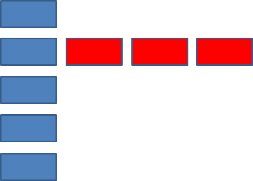

# Списки


**Ненумерованный список**

```html
<ul>
   <li>Coffee</li>
   <li>Tea</li>
   <li>Milk</li>
</ul>
```
<ul>
   <li>Coffee</li>
   <li>Tea</li>
   <li>Milk</li>
</ul>

**Нумерованный список**

```html
<ol>
   <li>Coffee</li>
   <li>Tea</li>
   <li>Milk</li>
</ol>
```

<ol>
   <li>Coffee</li>
   <li>Tea</li>
   <li>Milk</li>
</ol>

**Список определений**

```html
<dl>
  <dt>Coffee</dt>
  <dd>Black hot drink</dd>
  <dd>Black hot drink</dd>
  <dt>Milk</dt>
  <dd>White cold drink</dd>
</dl>
```
<dl>
  <dt>Coffee</dt>
  <dd>Black hot drink</dd>
  <dd>Black hot drink</dd>
  <dt>Milk</dt>
  <dd>White cold drink</dd>
</dl>


**CSS-свойства **

**list-style-type** - позволяет задавать стилистику маркеров, ввиде кружков, квадратиков, римских цифр и т.д.

Но самое полезное значение

```css
list-style-type:none; 
```
которое отключает все маркеры

**Практика:**

 1. Добавить класс в список ul. Через контекстные селекторы оформить элементы списка так как указано на картинке

  

 2. Сделать, чтобы при наведении на элемент, из него выпадало меню
 3. Сделать список с разделителями(к одному из li добавляем класс divider с соответствующим оформлением)
 
 4. Сделать многоуровневое выпадающее меню
 
 
 
 5. Есть меню сайта. При переходе на мобильную версию, оно заменяется на иконку меню. При наведении на иконку сбоку сайта вылетает меню.