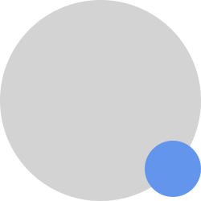

# До и после. Селекторы :before :after

Псевдо-атрибут ::before с помощью свойства content позволяет делать вставки перед контентом внутри блока.

Хак1: свойство content обязательно должно быть указано, пусть даже ввиде пустой строки.
Хак2: before и after являются inline-новыми пока мы это не поменяем.

Чтобы стало понятнее рассмотрим пример:

```css
p.box {
   width: 300px;
   border: solid 1px black;
   height:80px;
   line-height:80px;
}

p.box:before {
   content: "#";
   border: solid 1px black;
   padding: 10px;
   margin: 0 10px 0 0;
}
```

Результат можно посмотреть по ссылке
http://codepen.io/anon/pen/LNpZgB


**Полезное чтиво:**

1. Популярно о псевдоэлементах :Before и :After http://habrahabr.ru/post/154319/

2. Интересные кнопки с помощью :before :after
http://tympanus.net/codrops/2012/01/11/css-buttons-with-pseudo-elements/

3. Всплывающие подсказки на чистом CSS https://medium.freecodecamp.org/a-step-by-step-guide-to-making-pure-css-tooltips-3d5a3e237346 

4. Построение "перекошенной" верстки
https://kilianvalkhof.com/2017/design/sloped-edges-with-consistent-angle-in-css/

5. Различные варианты перекошенной верстки
https://tympanus.net/codrops/2011/12/21/slopy-elements-with-css3/

6. Пример сайта со "скошенной" версткой с помощью before и after https://www.securitywithoutborders.org/

7. Пример сайта с "клином"
https://codepen.io/kkhenriquez/pen/BpyMJL

8. Много примеров со скошенными краями https://hackernoon.com/how-to-code-sloped-section-edges-719886601ffd

9. Еще про скошенные края. Вариант через clip-path https://medium.com/@colinlord/creating-angles-with-clip-path-and-transforms-865c516dd2ef

10. Много вариантов от CSS-tricks
https://css-tricks.com/creating-non-rectangular-headers/


**Значение url()**

В качестве контента мы можем вставить картинку, но серьезный минус, что мы не можем настраивать её размер.

```css
.box:before {
   content:url('image.jpg');
}
```

Альтернативой этому является задание блоку before свойства display:inline-block, задание размеров и фоновой картинки.

```css
.box:before {
   content:"";
   display:inline-block;
   width:100px;
   height:100px;
   background-image:url('image.jpg');
}
```

**Значение attr()**

С помощью, этого значения можно добавлять данные в верстку через аттрибуты с префиксом data, а CSS автоматом их будет отображать.

```html
<div data-name="Vasya"></div>
<div data-name="Vova"></div>
<div data-name="Petya"></div>
```

Теперь добавим css, чтобы именна из атрибута отображались внутри блока.

```css
div[data-name]:before { 
	content: " " attr(data-name) "]"; 
}
```

1. Подробнее об использовании attr в content'e  
https://developer.mozilla.org/ru/docs/Web/CSS/attr
2. Примеры использования attr  
https://davidwalsh.name/css-content-attr

```css
div[data-line]:after { 
	content: "[line " attr(data-line) "]"; 
}
```

**Счетчики counter()**

Иногда нам нужно добиться автоматической нумерации элементов. Особенно, когда элементы динамически добавляются. Конечно можно решить эту задачу через JavaScript, но есть реализация через чистый css. Нам понадобится значение для контента counter

Свойство **counter-reset** инициализирует счетчик. Это свойство как правило ставится в блок, который встречается один раз, например в body.

**counter-increment** свойство, которое занимается увеличением счетчика

**content:counter()** - позволяет нам вывести значения счетчика

```css
body {
   counter-reset: my-awesome-counter;
}
div {
   counter-increment: my-awesome-counter;
}
div:before {
   content: counter(my-awesome-counter);
}
```

Мы можем увеличивать счетчик более, чем на единицу

```css
li
{
   list-style-type: none;
}

ol
{
   counter-reset: mysupercounter; 
}

li:before {
   counter-increment: mysupercounter 2;
   content: counter(mysupercounter) ". ";
}
```

Задаем стилистику для счетчика

```css
div:before {
  content: counter(my-awesome-counter, upper-roman);
}
```

**Полезное чтиво:**

1. Примеры с счетчиками
https://css-tricks.com/numbering-in-style/

2. Счетчики блоков на чистом css https://developer.mozilla.org/en-US/docs/Web/Guide/CSS/Counters

3. Подробно о различных вариантах counter-increment https://developer.mozilla.org/en/docs/Web/CSS/counter-increment


**CSS-Shapes**

Различные варианты фигур с помощью CSS
https://css-tricks.com/the-shapes-of-css/

**Практика:**

1. Создание кавычек вокруг блоков текста
2. Сделать класс для блока с номером телефона, чтобы слева от номера телефона автоматически появлялась иконка.
3. Сделать, чтобы при добавлении класса к блоку он превращался вот в такой элемент.

3. Сделать, так чтобы при добавлении класса к div, он превращался в кнопку следующего вида

4. Эффект стопки картинок
5. Сделать "блок-клин" (см. картинку ниже)

6. Эффект с тенями от "загнутых" углов
7. Сделать, чтобы при наведении на картинку весь остальной сайт затемнялся
8. Есть блоки с атрибутом data-type у блоков с картинками. Вывести блоки с подписями из data-type в левом верхнем углу блоков.
9. Создаем кнопки с автоматической нумерацией (состоящие из двух частей)
10. Создаем блоки с автоматической нумерацией (римская нумерация)
11. Поставить разные счетчики для блоков разных цветов


